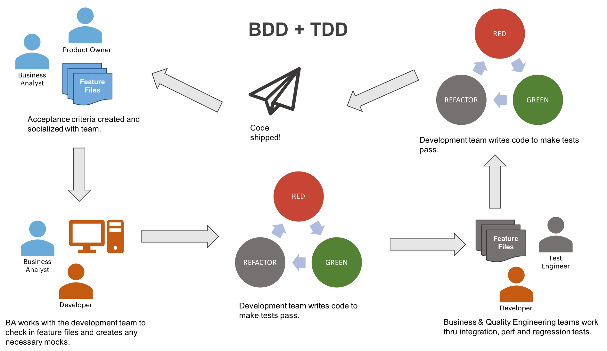

# BDD For All

No longer do your business, development and testing teams need to translate each others requirements and reports into something else to do their job.  This natural language, [behavior-driven development (BDD)](https://en.wikipedia.org/wiki/Behavior-driven_development) library exists to simplify the documenting of requirements and the testing of your API's.

Built on <a href="https://cucumber.io/" target="_blank">Cucumber</a> and <a href="http://rest-assured.io/" target="_blank">Rest Assured</a>, this library provides a [standard grammar](docs/GRAMMAR.md) (based on Gherkin) that all teams within your organization can use to relay requirements and test your applications.

*Example*

```gherkin
    Given I am a JSON API consumer
      And I am executing test "RSJ2"
     When I request GET "/json/users"
     Then I should get a status code of 200
      And the response value of "users[0].email" should equal "Sincere@april.biz"
      And the response value of "users[0].address.city" should not equal "Boston"
```

Although there are libraries like <a href="https://github.com/intuit/karate" target="_blank">Karate</a> and others that provide similar functionality, they are focused mainly on technical users, which means your Product/Solution Owners and SME's are still writing their own docs.  

This library was born out of this frustration. 

### Why BDD For All?

Requirements, always being interpreted from one document format (user story, technical docs, test cases, etc...) to another, create an additional overhead. Even worse, things often get lost or misinterpreted in translation.  We don't have time for that in one or two week sprints.

This library provides a lot of help out of the box to fix this...

* Simplifies and streamlines your Test Driven Development (TDD) flows.
* Simple [integration with build tools](#qiksetup) (Maven, Gradle, & SBT) as well as your DevOps pipelines (Jenkins, Bamboo, CircleCI, etc...).
* Test against any API's [regardless of language or platform](#commandline).
* Standard, well tested [step definitions](docs/GRAMMAR.md) that are easy to read/write for the entire business.
* Create complex flows with [request chaining](docs/CHAINING.md) (e.g. search for and then edit record).
* Data generation, supporting over 40 locales out of the box
* Run within [your project](#qiksetup) or as a [command line](#commandline) program
* Option to log all requests as [cURLs](docs/OTHERFEATURES.md#curl) to import into your favorite tools (postman, soapUI and more)
* Supports complex [Groovy GPath](docs/GPATH.md) expressions for those cases that require additional complexity
* Easy to use with any test framework ([JUnit](#qiksetup), TestNG, etc...) and works as a standalone library.
* Tests count towards your [code coverage](docs/OTHERFEATURES.md#coverage), reducing the need for unit tests.
* Simple [intuitive reporting](docs/REPORTING.md) out of the box.
* [Expressions](docs/OTHERFEATURES.md#tags) that allow you easily choose what tests to run (e.g. smoke, regression, etc...).

## How's it Work?

In most environments, contributors - which include Product Owners, Subject Matter Experts, Architects, Solution Owner/Architects, Tech/Team Leads, and more - create [scenarios](docs/SCENARIOS.md) which are added to [feature files](docs/FEATURES.md). In most cases these are added to existing project repositories (or newly created ones).

The developer then reviews the requirements (or acceptance criteria) and creates functionality to support, while running those scnearios as as tests with every change to confirm that there's been no regressions and that the feature is functionally complete.



### Samples

The [test](src/test/resources/features/) directory has a variety of sample feature files that show how to use all the features of the library.

## Using

For the definitive guide, checkout the [docs](docs/).

### Quick Setup for Existing Project (JUnit) <a name="qiksetup">&nbsp;</a>

Please note, this will work for JUnit 4.  The cucumber-jvm library doesn't [support 5 yet](https://github.com/cucumber/cucumber-jvm/issues/1149).

* First, [download](releases/releases/bdd-for-all-1.0-SNAPSHOT-jar-with-dependencies.jar) the latest jar.
* Next, install the jar  
  * [Maven](http://roufid.com/3-ways-to-add-local-jar-to-maven-project/)
  * [Gradle](https://appmediation.com/how-to-add-local-libraries-to-gradle/)
  * [SBT](http://flummox-engineering.blogspot.com/2014/06/sbt-use-jar-file-for-librarydependencies.html)
* Now, in the root of the directory you place your test classes in (typically src/test/java for JAVA projects, src/test/kotlin for Kotlin projects, etc...), place the following...
  * For JAVA
    ```java
    import static com.github.tomakehurst.wiremock.core.WireMockConfiguration.options;
    
    import com.github.tomakehurst.wiremock.common.Slf4jNotifier;
    import com.github.tomakehurst.wiremock.extension.responsetemplating.ResponseTemplateTransformer;
    import com.github.tomakehurst.wiremock.junit.WireMockRule;
    import cucumber.api.CucumberOptions;
    import cucumber.api.junit.Cucumber;
    import org.junit.ClassRule;
    import org.junit.Rule;
    import org.junit.runner.RunWith;
    
    @RunWith(Cucumber.class)
    @CucumberOptions(
        features = {"classpath:features"},
        plugin = {"pretty", "html:target/cucumber"},
        glue = { "com.accenture.testing.bdd.api.steps" }
    )
    public class RunCucumberTest {
    
      // initialize your server or mocks

    }
    ```
  * For Kotlin
    ```kotlin
    import cucumber.api.CucumberOptions
    import cucumber.api.junit.Cucumber
    import org.junit.runner.RunWith
    
    
    @RunWith(Cucumber::class)
    @CucumberOptions(
        features = ["src/test/resources/cucumber/features"],
        plugin = ["pretty", "html:target/cucumber"],
        glue = [ "com.accenture.testing.bdd.api.steps" ]
    )
    
    class RunKukesTest
  
    // initialize your server or mocks
  
    ```
  * For Scala
    ```scala
    import cucumber.api.CucumberOptions
    import cucumber.api.junit.Cucumber
    import org.junit.ClassRule
    import org.junit.Rule
    import org.junit.runner.RunWith
  
    
    @RunWith(classOf[Cucumber])
    @CucumberOptions(
      features = Array("classpath:features"),
      plugin = Array("pretty", "html:target/cucumber"),
      glue = Array("com.accenture.testing.bdd.api.steps")
    )
    class RunCucumberTest
    
    // initialize your server or mocks
  
    ```
* You'll want to start up your mocks or server as the harness assumes a running server. This class can use standard JUnit annotations, @ClassRule, @BeforeClass, @AfterClass.
  * For an example using wiremock, checkout our test runner - [src/test/java/RunCucumberTest.java](src/test/java/RunCucumberTest.java)
* Drop the application.conf and logback-test.xml files from [src/test/resources](src/test/resources) into your test resources directory.
  * If you already have logback, just add the configurations
  * In the application.conf file...
    * Update the server.host to be your url (no need to specify port if normal HTTP/HTTPS)
    * * Remove the sample header section, modify or add your own
* Now let's add your first .feature file
  * Create a directory called features in your test/resources directory
  * Create a file called Tests.feature with the following content...
  ```gherkin
  Feature: My first feature file
  Scenario: Check I can connect
    Given I am a JSON API consumer
      And I am executing test "CONN_TEST"
     When I request GET "/"
     Then I should get a status code of 200
  ```
  Make sure to replace "/" with a valid path on your server.
* Finally execute your test (e.g. `mvn test`, `sbt test`, `gradle test`)

You should see the test execute on screen and whether it passed or failed.  You can also look at...

* logs/bdd-testrun.log and curl.log for their outputs
* target/cucumber there should be an index.html for a cucumber report

For more configuration options, checkout https://docs.cucumber.io/cucumber/api/#junit

### Running Stand Alone  <a name="commandline">&nbsp;</a>

You can just execute the JAR file as well.

* Download the jar [releases/releases/bdd-for-all-1.0-SNAPSHOT-jar-with-dependencies.jar](releases/releases/bdd-for-all-1.0-SNAPSHOT-jar-with-dependencies.jar)
* Execute `java -Dconfig.file=<PATH_TO_CONFIG> -jar bdd-for-all-1.0-SNAPSHOT-jar-with-dependencies.jar <OPTIONS> <PATH_TO_FEATURE_FILE(S)>`
  * PATH_TO_CONFIG - relative or full-qualified path to application.conf file (example [src/test/resources/application.conf](src/test/resources/application.conf))
  * OPTIONS - Pass the -h (or --help) switch here to see all available options
  * PATH_TO_FEATURE_FILE(S) - relative or full-qualified path to a directory, a feature file
    * If specifying the name of a particular feature file you can also specify line numbers (e.g. My.feature:2:9) would load scenarios from lines 2 and 9
  
> Remember to pass the configuration file (e.g. *-Dconfig.file=<PATH_TO_CONFIG>*) BEFORE providing the -jar command, otherwise you will get an unknown option error