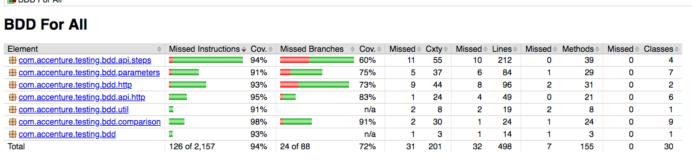

# Reporting

This library provides you a few outputs while running and when complete.

* First off, you have the inline view when running via the command line. It shows what's running and the status.  Those who use cucumber/junit should be pretty familiar with the view of the output...
  ```sbtshell
    @ResponseMatch @Regression @Json @ElementAnalysis
    Scenario: Path with numeric value occurances are equal to or more than X times (RSJ20) # features/ResponseStepsJson.feature:155
      Given I am a JSON API consumer                                                       # BasicSteps.java:46
      And I am executing test "RSJ20"                                                      # BasicSteps.java:80
      When I request GET "/json/todos"                                                     # BasicSteps.java:113
      Then the integer "10" must occur at least 20 times for "todos.userId"                # ResponseSteps.java:180
  
    @ResponseMatch @Regression @Json @ElementAnalysis
    Scenario: Path with numeric value occurances are less than or equal to X times (RSJ21) # features/ResponseStepsJson.feature:162
      Given I am a JSON API consumer                                                       # BasicSteps.java:46
      And I am executing test "RSJ21"                                                      # BasicSteps.java:80
      When I request GET "/json/todos"                                                     # BasicSteps.java:113
      Then the integer "10" must occur at least 20 times for "todos.userId"                # ResponseSteps.java:180
    
    90 Scenarios (31 undefined, 59 passed)
    299 Steps (299 passed)
    0m13.737s  
  ```
* If you haven't disabled it, you'll also have the cURL log, which provides [cURL representations](OTHERFEATURES.md#curl-logging) of the tests.
  ```sbtshell
  ## SCENARIO: Domain override (BS1)
  
  curl 'http://example.com/' \
    --request POST \
    --header 'Content-Type: application/x-www-form-urlencoded; charset=ISO-8859-1' \
    --header 'Accept: */*' \
    --header 'X-Made-Up-Header1: Header Value 1' \
    --header 'X-Correlation-ID: BS1' \
    --header 'User-Agent: ACN-BDD-CUCUMBER' \
    --header 'From: tester@example.com' \
    --header 'Content-Length: 0' \
    --header 'Host: example.com' \
    --header 'Connection: Keep-Alive' \
    --compressed \
    --verbose
  
  ## SCENARIO: Before timeout (BS2)
  
  curl 'http://localhost:8181/delayed' \
    --header 'Accept: */*' \
    --header 'X-Made-Up-Header1: Header Value 1' \
    --header 'X-Correlation-ID: BS2' \
    --header 'User-Agent: ACN-BDD-CUCUMBER' \
    --header 'From: tester@example.com' \
    --header 'Host: localhost:8181' \
    --header 'Connection: Keep-Alive' \
    --compressed \
    --verbose
  ```
* Next up, you have the [JaCoCo reports](OTHERFEATURES.md#jacoco-code-coverage).  
  
* And finally, if you followed the standard implementation instructions, you'll have you're Cucumber reports, which you'll find in your target directory in the "cucumber" folder. 
  > There are an array of plugins for "prettier" reports, which you can find at [https://docs.cucumber.io/cucumber/reporting/](https://docs.cucumber.io/cucumber/reporting/)